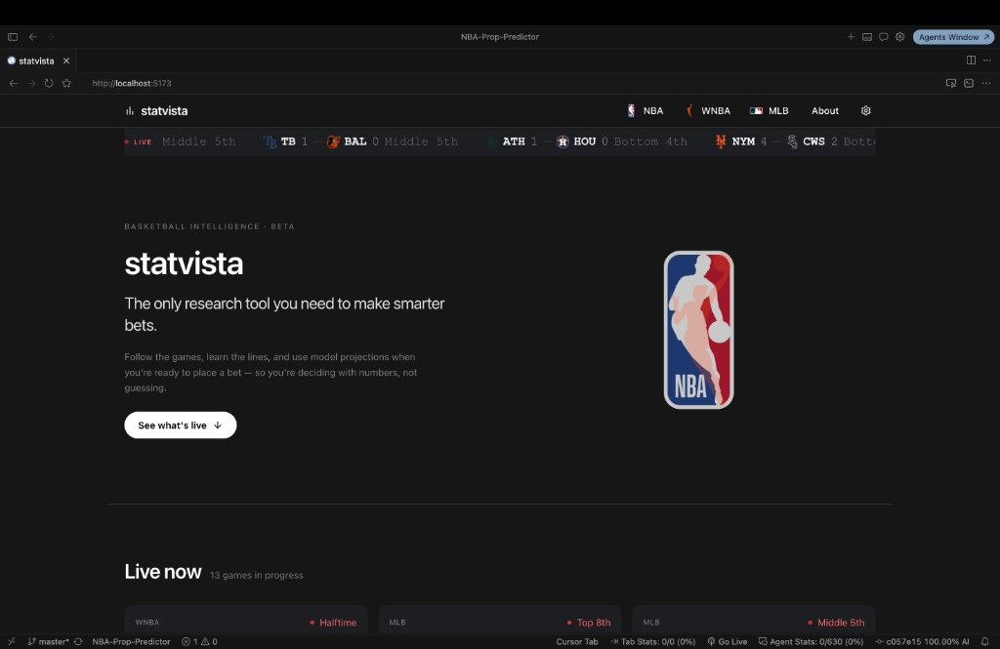
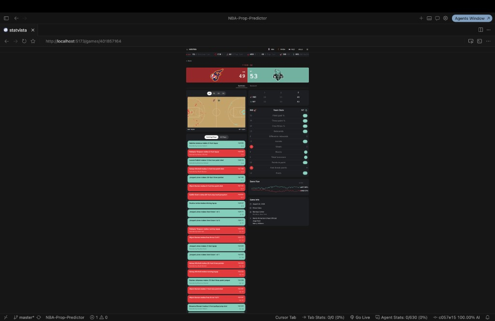
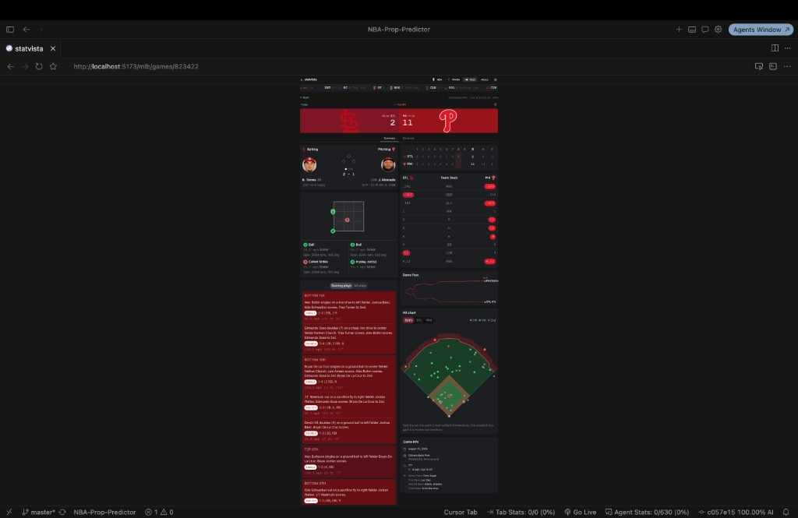

# statvista

Interactive basketball and baseball analytics — live scoreboards, matchup boards, prop context, and game centers for fans who want a clearer view of the slate.

**Status:** Not publicly deployed yet. Run locally to try the current build.

> Educational project only. Sports betting involves risk. Gamble responsibly.

---

## Screenshots

Home landing with a live ticker and a merged LIVE NOW board:

WNBA game center — shot chart, team stats, scoring plays, and game flow:

MLB game center — live situation, pitch tracking, team stats, and hit chart:

---

## What it does

statvista is a React + FastAPI research site that turns public sports feeds into readable boards:

- **Home** — brand hero, live ticker, and a merged LIVE NOW board (WNBA + MLB)
- **WNBA** — matchups with odds, DFS/US prop picks, leaders, standings, futures, player pages, and full game centers (shot chart, team stats, play-by-play, game flow)
- **MLB** — dated matchups with odds, plus live and final game detail (situation, pitch tracking, hit chart, win probability)
- **NBA** — matchups hub scaffolded; historical prop research pipeline still in the repo

The website read path talks to live upstream APIs (and Supabase odds snapshots). A separate Postgres medallion + quantile-ML path remains for research / batch props — see linked docs below.

---

## Where the data comes from

| Source | Used for |
|--------|----------|
| [ESPN](https://www.espn.com/) | WNBA scoreboard, standings, futures, game summary / win probability; MLB win-probability bridge |
| [stats.wnba.com](https://stats.wnba.com/) | Season leaders, player bio / averages / gamelog |
| [MLB Stats API](https://statsapi.mlb.com/) | MLB scoreboard and live/final game feeds |
| ParlayAPI / Sharp | WNBA and MLB sportsbook odds (spreads, totals, player props) |
| Supabase (Postgres) | PrizePicks / Underdog DFS prop snapshots; research warehouse |
| [RotoWire](https://www.rotowire.com/) | Projected starters for scheduled WNBA games |
| [NBA Stats API](https://github.com/swar/nba_api) (`nba_api`) | Historical NBA schedules and box scores (research ingest) |
| [The Odds API](https://the-odds-api.com) | Historical / research player-prop lines |
| [Basketball-Reference](https://www.basketball-reference.com/wnba/) | WNBA context tables |

---

## Tech stack

| Layer | Tools |
|-------|-------|
| Frontend | React 19, TypeScript, Vite, TanStack Query, Tailwind |
| API | FastAPI, Pydantic, OpenAPI → generated TS types |
| Live adapters | ESPN, stats.wnba.com, MLB Stats API, Parlay/Sharp, RotoWire |
| Storage | PostgreSQL (Supabase or local Docker) |
| Research ML | Python, dbt medallion layers, XGBoost quantile models |

---

## Try it locally

Deep setup lives next to the code:

- [frontend/README.md](frontend/README.md) — React app (`npm run dev`)
- [backend/README.md](backend/README.md) — FastAPI read path
- [docker/README.md](docker/README.md) — Compose profiles (Postgres, API, ETL)
- [models/README.md](models/README.md) — Prop ML methodology

Minimal loop: start the API, set `VITE_API_BASE_URL` if needed, run the frontend, open `http://localhost:5173`.

---

## Further reading

| Doc | Contents |
|-----|----------|
| [docs/superpowers/specs/2026-08-02-website-api-system-design.md](docs/superpowers/specs/2026-08-02-website-api-system-design.md) | Page ↔ API map for the live site |
| [docs/superpowers/specs/2026-08-02-portfolio-readme-design.md](docs/superpowers/specs/2026-08-02-portfolio-readme-design.md) | Why this README is shaped this way |

---

This project was made for **educational purposes only**. Sports betting involves risk. Gamble responsibly.
